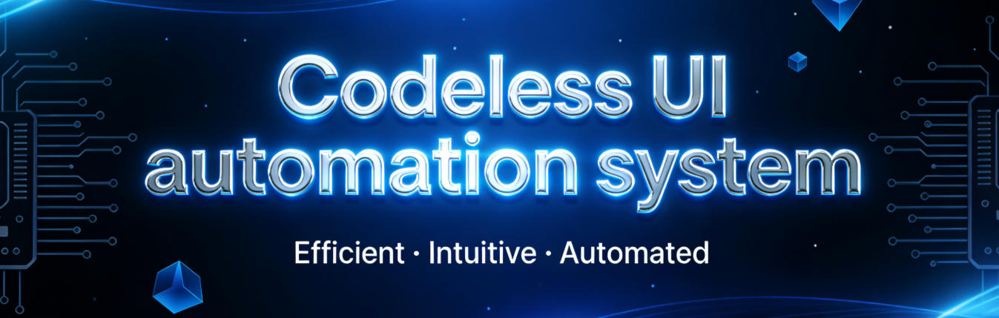
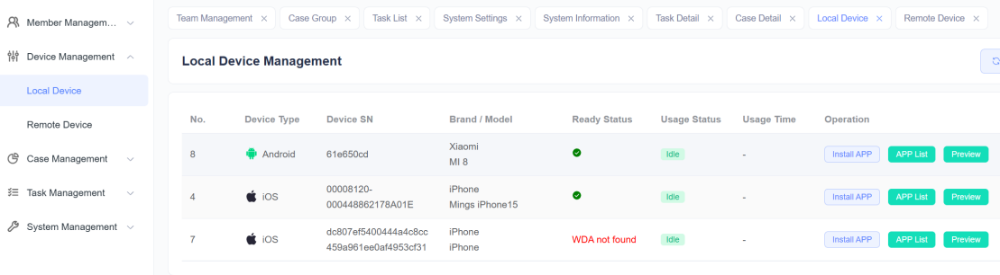
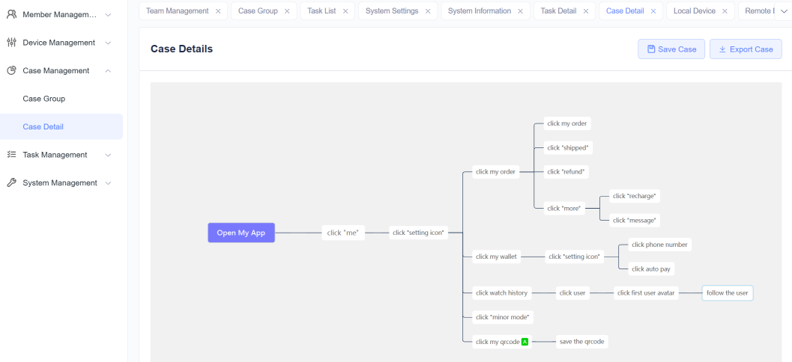
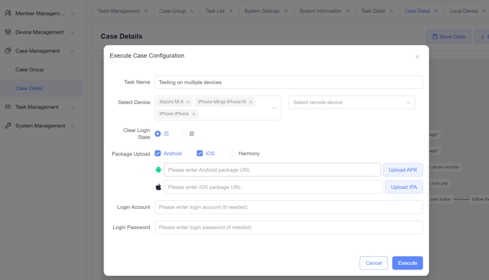
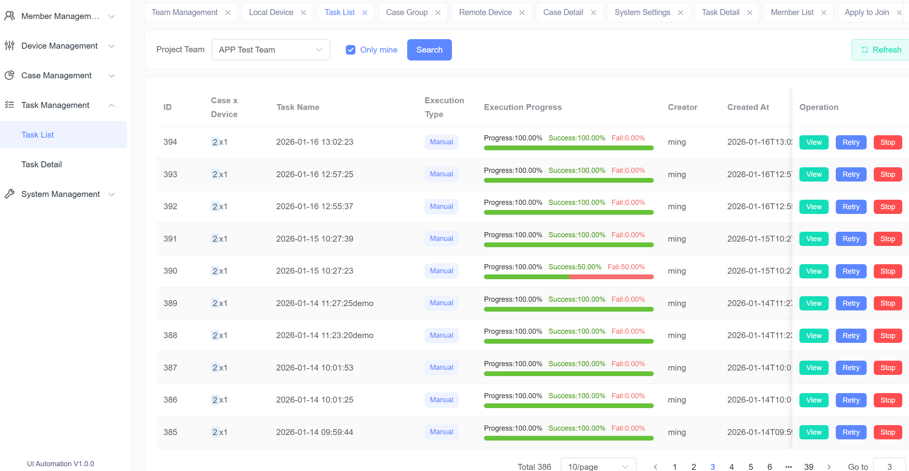
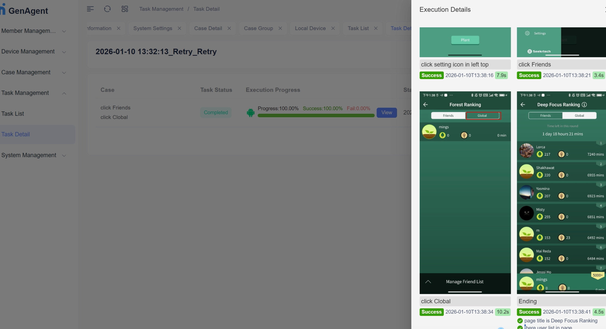

English | [简体中文](./README_cn.md) 
 
 [>>User Guide](./README_en_guide.md) 

# Why do we undertake this project?
 
I am a UI automation engineer, and I am well aware that in many companies, the popularity of UI automation is far lower than that of API automation. Many companies even completely disregard UI automation due to its low ROI.
 
Over the past 8 months, I have actively experimented with AI-enhanced UI automation frameworks, such as Midscene and Browser-use. I must say, they represent a qualitative improvement compared to traditional UI automation frameworks. However, after the initial excitement, I found that I still had to write a lot of code to manage test cases, configure package, and drive devices, especially for iOS 17+ devices, It was simply a nightmare. I believe someone understands what I am talking about🥲
 
Later, when the test development team was working on "overcoming difficulties" for the testing team, I realized that multiple solutions could be integrated into a single framework, allowing testers to focus on testing without being distracted by non-testing matters. This would enable professionals to do professional work. Thus, this project was born
 
# Why do we say it is different?
In a nutshell: it doesn't require testers to pay attention to things beyond testing.
 
There are already too many frameworks in this world. Let's study and research them, encapsulate them well, and let testers focus on business-related issues. Whoever has a deeper understanding of the business is the most important person in the company.
 
The following are several characteristics possessed by this project：
## Zero-cost deployment
The system has integrated drivers for Android/iOS/HarmonyOS/web, and encapsulated essential UI automation processes such as connecting to devices, opening target apps/URLs, and driving device execution. Once you obtain this system, you can immediately write/execute test cases, without having to consider the lengthy and complex UI automation project initiation process.

## Script-free
The system integrates a brain-inspired case management system, allowing users to describe case flows and assertions using natural language. The system utilizes the capabilities of large models to understand user intent, execute relevant elements, and provide assertion results. Compared to traditional UI automation projects, the efficiency of case writing has undergone a qualitative leap, and it is easier to review and adjust.

## Super Cross-Platform
This system can drive Android, iOS, HarmonyOS, and web execution cases on the three major mainstream PC/server systems: Windows, Mac, and Linux, and provide consistent results. Users do not need to consider the complex engineering issues faced by adapting to different platforms. Leveraging the capabilities of large models, the system eliminates platform differences and makes optimization adjustments, enabling one test case to be executed across multiple platforms.

# Why not open the source code?
To be frank, the current system is in the early stage of maturity, with an unclear organizational structure of code and insufficiently detailed annotations. Please give us some time.
 
If you wish to discuss technical details related to UI automation with me, I would be more than happy to!
# How to try out the system?
We appreciate every friend who shows interest in this system! However, during this period, our goal is to have in-depth communication with users to ensure that its implementation effect aligns with the target scenario, rather than just entertaining ourselves. 
## Therefore, we hope to prioritize deep cooperation with users who meet the following characteristics: 
### 1. There is an actual UI automation requirement in your business. 
### 2. You are interested in new AI-related technologies. 
### 3. You have the time to keep in touch with us, provide usage suggestions or report bugs. 
**Please contact us**
 
Email：uiautomation.ai@gmail.com
 
WhatsApp：[Group link](https://chat.whatsapp.com/JmKxBf5FvPiFuw09iMRngB)
 
Facebook Messenger: https://m.me/100013646796424
 
Discord：[discord](https://discord.com/channels/1464132923363164287/1464132924659208296)

