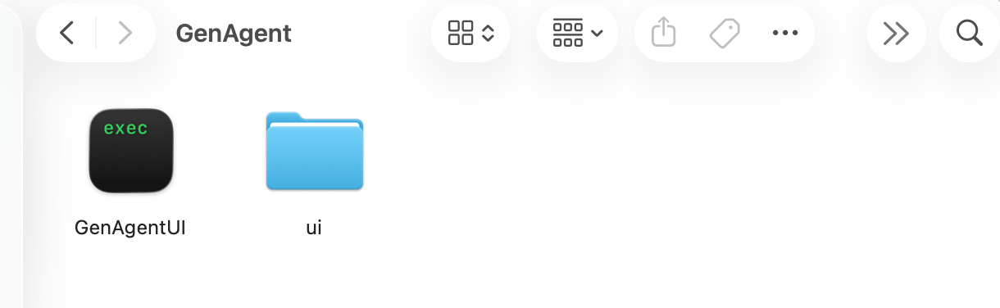
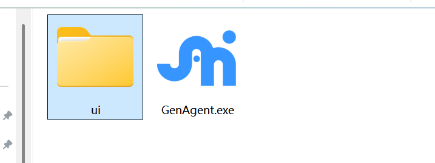
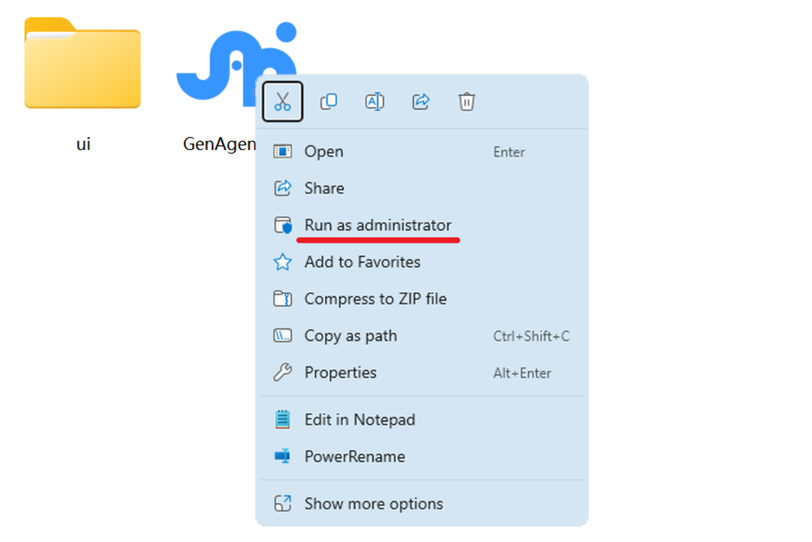
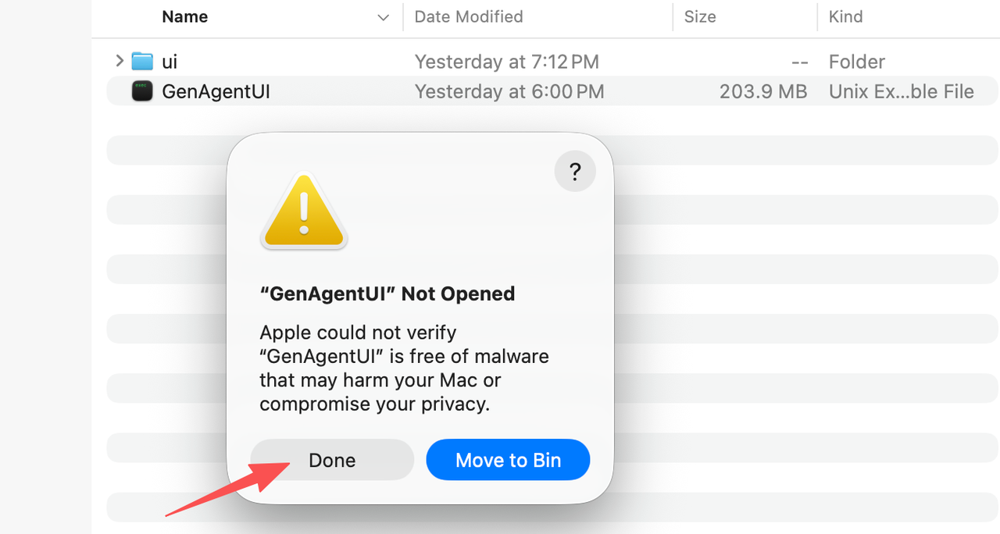
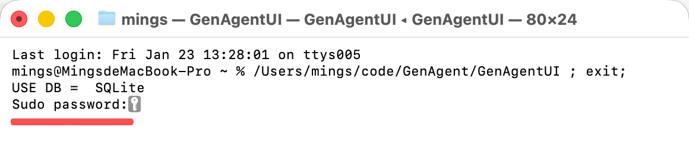
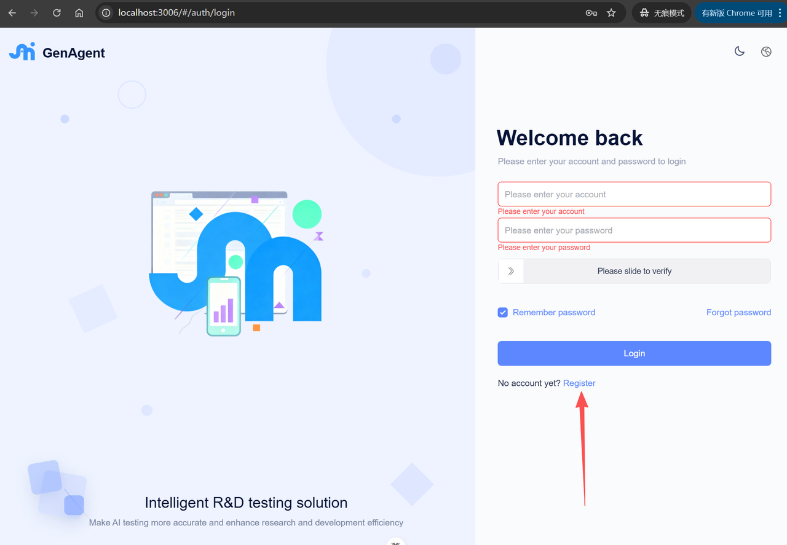
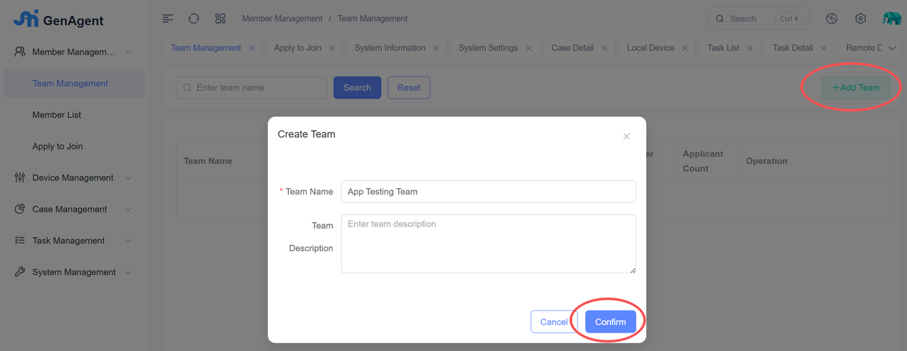
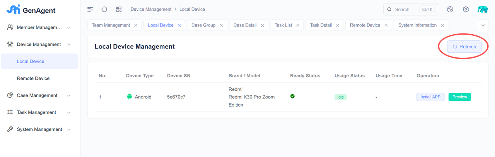
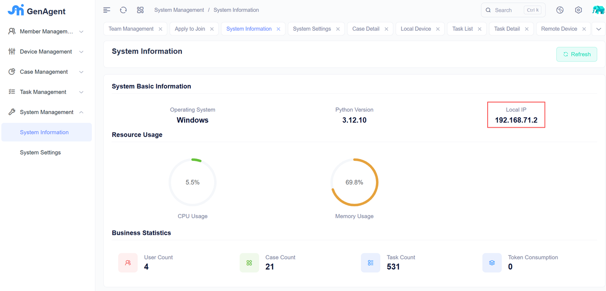

# Step 1
Contact us to obtain the software package.
 
 
Email：uiautomation.ai@gmail.com
 
WhatsApp：[Group link](https://chat.whatsapp.com/JmKxBf5FvPiFuw09iMRngB)
 
Discord：[discord](https://discord.com/channels/1464132923363164287/1464132924659208296)
 
Facebook Messenger: https://m.me/100013646796424

# Step 2 Unzip
Unzip it into an English-named directory, which contains an executable file and a folder named ui. Do not delete any content in the folder.

    

        
        
Mac

    

    

        
        
Windows

    

# Step 3: Execute the Project
## On Windows:
If you need to perform iPhone/iPad automated testing on Windows, you need to first download and install iTunes, and ensure that your iOS device can be successfully connected to iTunes. 
 
iTunes for windows: https://apps.microsoft.com/detail/9pb2mz1zmb1s
 
Right-click on GenAgent.exe, run it as an administrator (required), and then a command-line window will open. Wait for about 10 seconds. After the initialization is completed, a login system page will pop up, which means the system is ready. 
 

 
## On Mac:
Double-click GenAgentUI. When opening it for the first time, a prompt saying "GenAgentUI Not Opend" may appear. You need to click "Done" and then go to system settings-> Privacy&Security->Open Anyway as shown in the following example. 

    

        
    

    

        
    

After the setup is complete, double-clicking GenAgentUI again will launch a command window as shown below. The first execution is slower, taking approximately 30 seconds, during which you will need to enter your sudo password. Similarly, after the initialization is complete, a login system page will pop up. 
 

 
Note: Do not close the command-line window while the system is running. 

# Step 4: 
After the startup is completed, a system access address will pop up in the browser. This is the user interface of the system, which supports i18n and currently has two languages available: English and Chinese. At this point, you can click "Register" to register a local user.
 

# Step 5: 
Log in after registration, then you should first create a team, as subsequent use case management and execution management are all based on the team space.
 

# Step 6: 
Connect your phone to this computer. You can click the refresh button on the local device management page, and under normal circumstances, the phone will appear in the list.
 
This system can drive Android, iOS, HarmonyOS, and PC browsers to execute UI automation test cases. 
 
Pay special attention that when connecting an iOS device for the first time, be aware of the "Trust this computer?" pop-up window that may appear on the phone screen, or the pop-up window that requires you to enter the unlock password. iOS devices need to install WDA to execute test cases. 
 

# Step 7: 
If you wish other PCs within the local area network to access this system to achieve resource sharing and multi-user collaborative work, you can go to the "System Information" page to view the local IP, as shown in the following figure:
 
Other PCs can access this system via <local IP>:8600, and in this case, the local machine acts as a server to provide services. 
 

